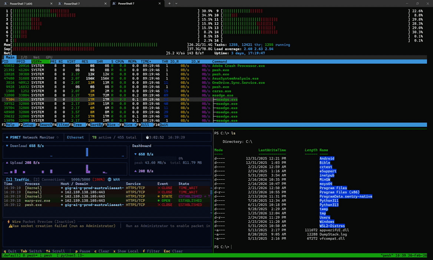

```
╔═══════════════════════════════════════════════════════════╗
║   ██████╗ ███████╗███╗   ███╗██╗   ██╗██╗  ██╗            ║
║   ██╔══██╗██╔════╝████╗ ████║██║   ██║╚██╗██╔╝            ║
║   ██████╔╝███████╗██╔████╔██║██║   ██║ ╚███╔╝             ║
║   ██╔═══╝ ╚════██║██║╚██╔╝██║██║   ██║ ██╔██╗             ║
║   ██║     ███████║██║ ╚═╝ ██║╚██████╔╝██╔╝ ██╗            ║
║   ╚═╝     ╚══════╝╚═╝     ╚═╝ ╚═════╝ ╚═╝  ╚═╝            ║
║     Born in PowerShell. Made in Rust. 🦀                 ║
║          Terminal Multiplexer for Windows                 ║
╚═══════════════════════════════════════════════════════════╝
```

<p align="center">
  <strong>The native Windows tmux. Born in PowerShell, made in Rust.</strong><br/>
  Full mouse support · tmux themes · tmux config · 76 commands · blazing fast
</p>

<p align="center">
  <a href="#installation">Install</a> ·
  <a href="#usage">Usage</a> ·
  <a href="#performance">Performance</a> ·
  <a href="#tmux-compatibility">Compatibility</a> ·
  <a href="docs/features.md">Features</a> ·
  <a href="docs/keybindings.md">Keys</a> ·
  <a href="docs/scripting.md">Scripting</a> ·
  <a href="docs/configuration.md">Config</a> ·
  <a href="docs/faq.md">FAQ</a>
</p>

---

# psmux

**The real tmux for Windows.** Not a port, not a wrapper, not a workaround.

psmux is a **native Windows terminal multiplexer** built from the ground up in Rust. It uses Windows ConPTY directly, speaks the tmux command language, reads your `.tmux.conf`, and supports tmux themes. All without WSL, Cygwin, or MSYS2.

> 💡 **Tip:** psmux ships with `tmux` and `pmux` aliases. Just type `tmux` and it works!

👀 On Windows 👇



## Installation

### Using WinGet

```powershell
winget install psmux
```

### Using Cargo

```powershell
cargo install psmux
```

This installs `psmux`, `pmux`, and `tmux` binaries to your Cargo bin directory.

### Using Scoop

```powershell
scoop bucket add psmux https://github.com/marlocarlo/scoop-psmux
scoop install psmux
```

### Using Chocolatey

```powershell
choco install psmux
```

### From GitHub Releases

Download the latest `.zip` from [GitHub Releases](https://github.com/marlocarlo/psmux/releases) and add to your PATH.

### From Source

```powershell
git clone https://github.com/marlocarlo/psmux.git
cd psmux
cargo build --release
```

Built binaries:

```text
target\release\psmux.exe
target\release\pmux.exe
target\release\tmux.exe
```

### Docker (build environment)

A ready-made Windows container with Rust + MSVC + SSH for building psmux:

```powershell
cd docker
docker build -t psmux-dev .
docker run -d --name psmux-dev -p 127.0.0.1:2222:22 -e ADMIN_PASSWORD=YourPass123! psmux-dev
ssh ContainerAdministrator@localhost -p 2222
```

See [docker/README.md](docker/README.md) for full details.

### Requirements

- Windows 10 or Windows 11
- **PowerShell 7+** (recommended) or cmd.exe
  - Download PowerShell: `winget install --id Microsoft.PowerShell`
  - Or visit: https://aka.ms/powershell

## Why psmux?

If you've used tmux on Linux/macOS and wished you had something like it on Windows, **this is it**.

| | psmux | Windows Terminal tabs | WSL + tmux |
|---|:---:|:---:|:---:|
| Session persist (detach/reattach) | ✅ | ❌ | ⚠️ WSL only |
| Synchronized panes | ✅ | ❌ | ✅ |
| tmux keybindings | ✅ | ❌ | ✅ |
| Reads `.tmux.conf` | ✅ | ❌ | ✅ |
| tmux theme support | ✅ | ❌ | ✅ |
| Native Windows shells | ✅ | ✅ | ❌ |
| Full mouse support | ✅ | ✅ | ⚠️ Partial |
| Zero dependencies | ✅ | ✅ | ❌ (needs WSL) |
| Scriptable (76 commands) | ✅ | ❌ | ✅ |

Split panes, multiple windows, session persistence, 76 commands, full mouse, tmux themes, 126+ format variables, 53 vim copy-mode keys. Full details: **[docs/features.md](docs/features.md)**

## Performance

psmux is built for speed. The Rust release binary is compiled with **opt-level 3**, **full LTO**, and **single codegen unit**. Every cycle counts.

| Metric | psmux | Notes |
|--------|-------|-------|
| **Session creation** | **< 100ms** | Time for `new-session -d` to return |
| **New window** | **< 80ms** | Overhead on top of shell startup |
| **New pane (split)** | **< 80ms** | Same as window, cached shell resolution |
| **Startup to prompt** | **~shell launch time** | psmux adds near-zero overhead; bottleneck is your shell |
| **15+ windows** | ✅ Stable | Stress-tested with 15+ rapid windows, 18+ panes, 5 concurrent sessions |
| **Rapid fire creates** | ✅ No hangs | Burst-create windows/panes without delays or orphaned processes |

### How it's fast

- **Lazy pane resize** : only the active window's panes are resized. Background windows resize on-demand when switched to, avoiding O(n) ConPTY syscalls
- **Cached shell resolution** : `which` PATH lookups are cached with `OnceLock`, not repeated per spawn
- **10ms polling** : client-server discovery uses tight 10ms polling for sub-100ms session attach
- **Early port-file write** : server writes its discovery file *before* spawning the first shell, so the client connects instantly
- **8KB reader buffers** : small buffer size minimizes mutex contention across pane reader threads

> **Note:** The primary startup bottleneck is your shell (PowerShell 7 takes ~400-1000ms to display a prompt). psmux itself adds < 100ms of overhead. For faster shells like `cmd.exe` or `nushell`, total startup is near-instant.

## tmux Compatibility

psmux is the most tmux-compatible terminal multiplexer on Windows:

| Feature | Support |
|---------|---------|
| Commands | **76** tmux commands implemented |
| Format variables | **126+** variables with full modifier support |
| Config file | Reads `~/.tmux.conf` directly |
| Key bindings | `bind-key`/`unbind-key` with key tables |
| Hooks | 15+ event hooks (`after-new-window`, etc.) |
| Status bar | Full format engine with conditionals and loops |
| Themes | 14 style options, 24-bit color, text attributes |
| Layouts | 5 layouts (even-h, even-v, main-h, main-v, tiled) |
| Copy mode | 53 vim keybindings, search, registers |
| Targets | `session:window.pane`, `%id`, `@id` syntax |
| `if-shell` / `run-shell` | ✅ Conditional config logic |
| Paste buffers | ✅ Full buffer management |

**Your existing `.tmux.conf` works.** psmux reads it automatically. Just install and go.

## Plugins & Themes

psmux has a full plugin ecosystem — ports of the most popular tmux plugins, reimplemented in PowerShell for Windows. Themes, key bindings, session management, clipboard integration, and more.

**Browse available plugins and themes:** [**psmux-plugins**](https://github.com/marlocarlo/psmux-plugins)

**Install & manage plugins with a TUI:** [**Tmux Plugin Panel (tppanel)**](https://github.com/marlocarlo/tppanel) — a terminal UI for browsing, installing, updating, and removing plugins and themes.

| Plugin | Description |
|--------|-------------|
| [psmux-sensible](https://github.com/marlocarlo/psmux-plugins/tree/main/psmux-sensible) | Sensible defaults for psmux |
| [psmux-yank](https://github.com/marlocarlo/psmux-plugins/tree/main/psmux-yank) | Windows clipboard integration |
| [psmux-resurrect](https://github.com/marlocarlo/psmux-plugins/tree/main/psmux-resurrect) | Save/restore sessions |
| [psmux-pain-control](https://github.com/marlocarlo/psmux-plugins/tree/main/psmux-pain-control) | Better pane navigation |
| [psmux-prefix-highlight](https://github.com/marlocarlo/psmux-plugins/tree/main/psmux-prefix-highlight) | Prefix key indicator |
| [ppm](https://github.com/marlocarlo/psmux-plugins/tree/main/ppm) | Plugin manager (like tpm) |

**Themes:** Catppuccin · Dracula · Nord · Tokyo Night · Gruvbox

Quick start:
```powershell
# Install the plugin manager
git clone https://github.com/marlocarlo/psmux-plugins.git "$env:TEMP\psmux-plugins" ; Copy-Item "$env:TEMP\psmux-plugins\ppm" "$env:USERPROFILE\.psmux\plugins\ppm" -Recurse ; Remove-Item "$env:TEMP\psmux-plugins" -Recurse -Force
```
Then add to your `~/.psmux.conf`:
```
set -g @plugin 'psmux-plugins/ppm'
set -g @plugin 'psmux-plugins/psmux-sensible'
run '~/.psmux/plugins/ppm/ppm.ps1'
```
Press `Prefix + I` inside psmux to install the declared plugins.

## Usage

Use `psmux`, `pmux`, or `tmux`, they're identical:

```powershell
# Start a new session
psmux
pmux
tmux

# Start a named session
psmux new-session -s work
tmux new-session -s work

# List sessions
psmux ls
tmux ls

# Attach to a session
psmux attach -t work
tmux attach -t work

# Show help
psmux --help
tmux --help
```

## Mouse Over SSH

psmux has **first-class mouse support over SSH** when the server runs **Windows 11 build 22523+ (22H2+)**. Click panes, drag-resize borders, scroll, click tabs — everything works, from any SSH client on any OS.

### Compatibility

| Client → Server | Keyboard | Mouse | Notes |
|---|:---:|:---:|---|
| Linux → Windows 11 (22523+) | ✅ | ✅ | Full support |
| macOS → Windows 11 (22523+) | ✅ | ✅ | Full support |
| Windows 10 → Windows 11 (22523+) | ✅ | ✅ | Full support |
| Windows 11 → Windows 11 (22523+) | ✅ | ✅ | Full support |
| WSL → Windows 11 (22523+) | ✅ | ✅ | Full support |
| Any OS → Windows 10 | ✅ | ❌ | ConPTY limitation (see below) |
| Any OS → Windows 11 (pre-22523) | ✅ | ❌ | ConPTY limitation (see below) |

### Local use (no SSH)

| Platform | Keyboard | Mouse |
|---|:---:|:---:|
| Windows 11 (local) | ✅ | ✅ |
| Windows 10 (local) | ✅ | ✅ |

Mouse works perfectly when running psmux locally on both Windows 10 and 11.

### Why no mouse over SSH on Windows 10?

Windows 10's ConPTY consumes mouse-enable escape sequences internally and does not forward them to sshd. The SSH client never receives the signal to start sending mouse data. This is a Windows 10 ConPTY limitation that was fixed in Windows 11 (build 22523+). Keyboard input works fully on both versions — only mouse over SSH is affected.

> **Recommendation:** Use Windows 11 build 22523+ (22H2 or later) as your psmux server for full SSH mouse support.

## Key Bindings

Default prefix: `Ctrl+b` (same as tmux). Full reference: **[docs/keybindings.md](docs/keybindings.md)**

| Key | Action |
|-----|--------|
| `Prefix + c` | Create new window |
| `Prefix + %` / `"` | Split pane horizontally / vertically |
| `Prefix + Arrow` | Navigate between panes |
| `Prefix + d` | Detach from session |
| `Prefix + z` | Toggle pane zoom |
| `Prefix + [` | Enter copy/scroll mode (53 vim keybindings) |
| `Ctrl+q` | Quit |

## Scripting & Automation

76 tmux-compatible commands, hooks, targets, `capture-pane`, `pipe-pane`. Full reference: **[docs/scripting.md](docs/scripting.md)**

## Configuration

Reads `~/.psmux.conf`, `~/.tmux.conf`, or `~/.config/psmux/psmux.conf`. Fully tmux-compatible syntax — your existing config works. Full reference: **[docs/configuration.md](docs/configuration.md)**

## License

MIT

---

## Contributing

Contributions welcome — bug reports, PRs, docs, and test scripts via [GitHub Issues](https://github.com/marlocarlo/psmux/issues).

If psmux helps your Windows workflow, consider giving it a ⭐ on GitHub!

**[docs/faq.md](docs/faq.md)** · **[docs/features.md](docs/features.md)** · **[docs/keybindings.md](docs/keybindings.md)** · **[docs/scripting.md](docs/scripting.md)** · **[docs/configuration.md](docs/configuration.md)**

---

<p align="center">
  Made with ❤️ for PowerShell using Rust 🦀
</p>
